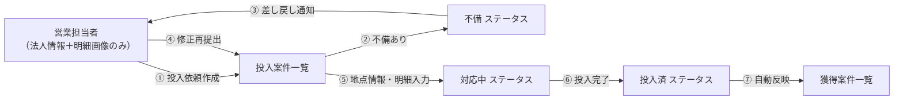
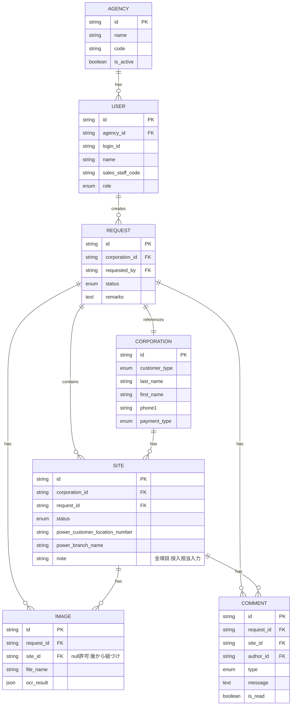
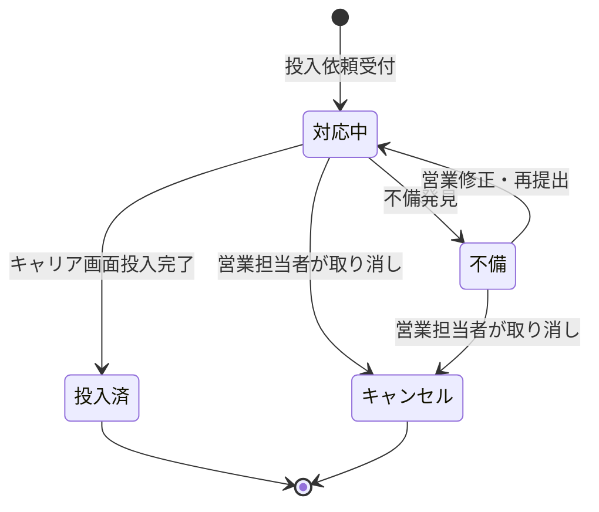
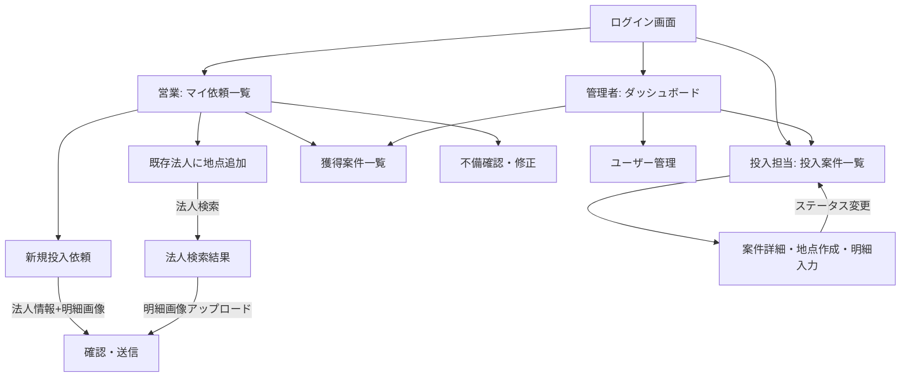

# FMT CRM 要件定義書 v1.1

> **ステータス:** 要件確定（レビュー待ち）
> **最終更新:** 2026-02-12
> **対象システム:** エネパル（ハルエネでんき）キャリア管理画面に対応するCRM

---

## 1. 概要・目的

営業担当者がキャリア管理画面（エネパル）への申込情報を **投入依頼** として提出し、投入担当者がその情報を元にキャリア管理画面へ入力（投入）する業務フローを管理するCRMシステム。

### 業務フロー



### 主要な方針決定事項

| # | 項目 | 決定内容 |
|---|------|---------|
| 1 | 法人と地点 | 既存法人を検索して地点追加可能。新規法人は全項目入力 |
| 2 | 依頼の粒度 | 1依頼 = 1法人 + 明細画像（地点情報は投入担当が入力） |
| 3 | 不備対応 | 営業担当者へ差し戻し。不備理由を記録・通知 |
| 4 | ユーザー管理 | ログイン機能必要 |
| 5 | 明細入力 | 手動転記。将来OCR対応を見据えた設計 |
| 6 | 技術スタック | Phase1: HTML/CSS/JS + LocalStorage → Phase2: Firebase |
| 7 | キャリア連携 | 可能ならAPI自動連携を目指す |
| 8 | 投入依頼キャンセル | 営業担当者が提出後に取り消し可能。ステータス「キャンセル」を追加 |
| 9 | 法人情報編集 | 営業担当者・投入担当者どちらも修正可能 |
| 10 | 通知方法 | Phase1: アプリ内バッジ通知 / Phase2: プッシュ通知 |
| 11 | 代理店データ隔離 | 営業担当者は自分の代理店の案件のみ表示 |
| 12 | 投入担当者の所属 | 全代理店を横断して対応 |
| 13 | 同時編集 | Phase1: 同一ブラウザ前提 / Phase2: 排他制御実装 |
| 14 | 監査ログ | Phase1から変更履歴・操作ログを実装 |

---

## 2. データ構造（法人＝親 / 地点＝子）

> [!IMPORTANT]
> 1法人が複数の地点（店舗・事務所等）を持つことを前提に、**地点単位**でデータを管理する。

### 2.1 代理店テーブル

| カラム名 | 型 | 説明 |
|---------|-----|------|
| `id` | string | 代理店ID（自動採番） |
| `name` | string | 代理店名 |
| `code` | string | 代理店コード（一意識別子） |
| `referral_shop_code` | string | 紹介店コード（キャリア管理画面用） |
| `referral_shop_name` | string | 紹介店名 |
| `contact_name` | string | 担当者名 |
| `phone` | string | 電話番号 |
| `mail_address` | string | メールアドレス |
| `is_active` | boolean | 有効/無効 |
| `created_at` | datetime | 作成日時 |
| `updated_at` | datetime | 更新日時 |

> [!NOTE]
> `referral_shop_code` と `referral_shop_name` は、キャリア管理画面の1pageの紹介店コード・紹介店名に対応。代理店ごとに管理者が割り振る。

### 2.2 ユーザーテーブル

| カラム名 | 型 | 説明 |
|---------|-----|------|
| `id` | string | ユーザーID（自動採番） |
| `agency_id` | string | 代理店ID（FK）※営業担当者は必須、管理者はnull可 |
| `login_id` | string | ログインID |
| `password_hash` | string | パスワード（ハッシュ化） |
| `name` | string | 氏名 |
| `sales_staff_code` | string | 営業担当者コード（例: `LCK0A0AY`） |
| `l_code` | string | Lコード（販売員単位の識別コード。キャリア管理画面の紹介店担当者名に対応） |
| `role` | enum | `sales`（営業）/ `operator`（投入担当）/ `admin`（管理者） |
| `created_at` | datetime | 作成日時 |

### 2.3 投入依頼テーブル

| カラム名 | 型 | 説明 |
|---------|-----|------|
| `id` | string | 依頼ID（自動採番） |
| `corporation_id` | string | 法人ID（FK） |
| `requested_by` | string | 依頼者ユーザーID（FK） |
| `status` | enum | 全体ステータス（後述） |
| `remarks` | text | 備考（支払方法の分割指示、明細画像がない場合の明細情報等） |
| `site_count` | number | 地点数（営業が申告、投入担当が画像から判断して調整） |
| `created_at` | datetime | 依頼日時 |
| `updated_at` | datetime | 更新日時 |

### 2.4 法人テーブル（親）

キャリア管理画面の `1page`（契約者情報）と `2page`（支払方法）に対応する共通情報。

| カラム名 | 型 | 説明 | 元フィールド |
|---------|-----|------|------------|
| `id` | string | 法人ID（自動採番） | - |
| `customer_type` | enum | 契約者区分（1:個人/2:法人/3:屋号） | `customer_type` |
| `corporation_number` | string | 法人番号（13桁） | `corporation_number` |
| `last_name` | string | 契約者名（姓） | `last_name` |
| `first_name` | string | 契約者名（名） | `first_name` |
| `last_name_kana` | string | 契約者名カナ（セイ） | `last_name_kana` |
| `first_name_kana` | string | 契約者名カナ（メイ） | `first_name_kana` |
| `representative_last_name` | string | 代表者名（姓） | `representative_last_name` |
| `representative_first_name` | string | 代表者名（名） | `representative_first_name` |
| `representative_last_name_kana` | string | 代表者カナ（セイ） | `representative_last_name_kana` |
| `representative_first_name_kana` | string | 代表者カナ（メイ） | `representative_first_name_kana` |
| `zip_code` | string | 郵便番号 | `zip_code1`+`zip_code2` |
| `prefecture` | string | 都道府県 | `prefecture` |
| `city` | string | 市区町村 | `city` |
| `town` | string | 町域 | `town` |
| `street` | string | 字・丁目＋番地号 | `street_number_*` |
| `building_name` | string | 建物名 | `building_name` |
| `phone1` | string | 連絡先番号1 | `phone1`〜`phone3` |
| `phone2` | string | 連絡先番号2 | `phone2_1`〜`phone2_3` |
| `mail_address` | string | メールアドレス | `mail_address` |
| `birthday` | date | 生年月日 | `birthday_*` |
| `representative_birthday` | date | 代表者の生年月日 | `representative_birthday_*` |
| `job_type` | string | 業種 | `job_type` |
| `payment_type` | enum | 支払方法（1:クレカ/2:口座振替/3:コンビニ） | `payment_type` |
| `credit_card_number` | string | クレジットカード番号 | `credit_card_number` |
| `credit_card_expire_month` | string | カード有効期限（月） | `credit_card_expire_month` |
| `credit_card_expire_year` | string | カード有効期限（年） | `credit_card_expire_year` |
| `credit_card_name` | string | カード名義 | `credit_card_name` |
| `credit_card_security_code` | string | セキュリティコード | `credit_card_security_code` |
| `invoice` | enum | 請求明細（0:不要/3:要） | `invoice` |
| `payment_certificate` | enum | 支払証明（0:不要/1:要） | `payment_certificate` |
| `billing_address_same` | boolean | 請求書送付先が契約者住所と同一か | `payment_location_address_type` |
| `billing_zip_code` | string | 請求書送付先郵便番号（別住所の場合） | `payment_zip_code1`+`2` |
| `billing_prefecture` | string | 請求書送付先都道府県 | `payment_prefecture` |
| `billing_city` | string | 請求書送付先市区町村 | `payment_city` |
| `billing_town` | string | 請求書送付先町域 | `payment_town` |
| `billing_street` | string | 請求書送付先番地 | `payment_street_number_*` |
| `billing_building` | string | 請求書送付先建物名 | `payment_building_name` |
| `billing_customer_name` | string | 請求書送付先宛名 | `payment_customer_name` |
| `sales_channel_id` | string | 営業チャネル | `sales_channel_id` |
| `created_at` | datetime | 作成日時 | - |
| `updated_at` | datetime | 更新日時 | - |

> [!NOTE]
> - クレジットカード情報はCRMに保存する。Phase 2では暗号化を検討。
> - 請求書送付先は、契約者住所と異なる場合のみ入力。`billing_address_same` が true の場合、送付先項目は空。
> - 家族同意者（代理人）情報は管理**不要**。

### 2.5 地点テーブル（子）

キャリア管理画面の `5page`（申込情報入力）に対応する地点ごとの情報。

> [!IMPORTANT]
> **地点レコードは全て投入担当者が作成・入力する。** 営業担当者は法人情報と明細画像のみ提出し、投入担当者が画像を参照して地点情報を入力する。

| カラム名 | 型 | 説明 | 入力者 | 元フィールド |
|---------|-----|------|:------:|------------|
| `id` | string | 地点ID（自動採番） | 自動 | - |
| `corporation_id` | string | 法人ID（FK） | 自動 | - |
| `request_id` | string | 投入依頼ID（FK） | 自動 | - |
| `status` | enum | 地点ステータス（不備/対応中/投入済） | 投入担当 | - |
| `pps_business_number` | string | PPS番号 | 投入担当 | `pps_business_number` |
| `application_type` | enum | 申込区分 | 投入担当 | `application_type` |
| `power_plan_name` | string | 契約プラン名 | 投入担当 | 検索結果 |
| `contract_capacity` | string | 契約容量 | 投入担当 | `contract_capacity_form` |
| `power_supplier_type` | string | 現在の電力会社 | 投入担当 | `power_supplier_type` |
| `power_customer_number` | string | お客様番号 | 投入担当 | `power_customer_number` |
| `power_customer_location_number` | string | 供給地点特定番号 | 投入担当 | `power_customer_location_number` |
| `power_zip_code` | string | 使用場所郵便番号 | 投入担当 | `power_zip_code1`+`2` |
| `power_prefecture` | string | 使用場所都道府県 | 投入担当 | `power_prefecture` |
| `power_city` | string | 使用場所市区町村 | 投入担当 | `power_city` |
| `power_town` | string | 使用場所町域 | 投入担当 | `power_town` |
| `power_street` | string | 使用場所番地 | 投入担当 | `power_street_*` |
| `power_building` | string | 使用場所建物 | 投入担当 | `power_building_*` |
| `power_room_number` | string | 部屋番号 | 投入担当 | `power_room_number` |
| `power_building_type` | string | 建物区分 | 投入担当 | `power_building_type` |
| `power_branch_name` | string | 店舗名 | 投入担当 | `power_branch_name` |
| `power_customer_name` | string | 名義 | 投入担当 | `power_customer_name` |
| `power_customer_name_kana` | string | 名義カナ | 投入担当 | `power_customer_name_kana` |
| `latest_charges` | number | 最新の明細料金（円） | 投入担当 | `latest_electricity_charges` |
| `latest_power_usage` | number | 最新の電力使用量（kWh） | 投入担当 | `latest_electricity_power_usage` |
| `latest_date` | string | 最新の明細年月 | 投入担当 | `latest_electricity_date_*` |
| `option_plans` | JSON | 選択オプション | 投入担当 | 動的 |
| `moving_in_date` | date | 入居日/開業日 | 投入担当 | `moving_in_*` |
| `note` | text | メモ/備考 | 投入担当 | `note` |
| `service_type` | enum | サービス種別（電気/ガス） | 投入担当 | PPS選択から判定 |
| `contract_corporation_type` | string | 契約者法人種別（エコログガス用） | 投入担当 | `contract_corporation_type` |
| `saisan_gas_yoto` | string | サイサンガス専用業種 | 投入担当 | `saisan_gas_yoto` |
| `ecolog_gas_yoto` | string | エコログガス用途分類 | 投入担当 | `ecolog_gas_yoto` |
| `power_amounts_form` | string | 力率 | 投入担当 | `power_amounts_form` |
| `created_at` | datetime | 作成日時 | 自動 | - |
| `updated_at` | datetime | 更新日時 | 自動 | - |

> 全項目が投入担当者の入力。将来OCR対応時は自動入力→確認修正のフローになる。

### 2.6 明細画像テーブル

| カラム名 | 型 | 説明 |
|---------|-----|------|
| `id` | string | 画像ID（自動採番） |
| `request_id` | string | 投入依頼ID（FK）※営業がアップロード時は依頼に紐づく |
| `site_id` | string | 地点ID（FK、null許可）※投入担当が画像と地点を紐づけ |
| `file_name` | string | ファイル名 |
| `file_data` | string | Base64エンコードデータ（LocalStorage用） |
| `ocr_result` | JSON | OCR結果（将来用、null許可） |
| `uploaded_at` | datetime | アップロード日時 |

### 2.7 不備・コメントテーブル

| カラム名 | 型 | 説明 |
|---------|-----|------|
| `id` | string | コメントID（自動採番） |
| `request_id` | string | 投入依頼ID（FK） |
| `site_id` | string | 地点ID（FK、null許可＝法人全体への不備） |
| `author_id` | string | 投稿者ユーザーID（FK） |
| `type` | enum | `deficiency`（不備通知）/ `comment`（一般コメント） |
| `message` | text | 不備理由・コメント内容 |
| `is_read` | boolean | 既読フラグ |
| `created_at` | datetime | 作成日時 |

### 2.8 監査ログテーブル

> [!IMPORTANT]
> **Phase 1から実装**。誰が・いつ・何を変更したかを全て記録する。

| カラム名 | 型 | 説明 |
|---------|-----|------|
| `id` | string | ログID（自動採番） |
| `user_id` | string | 操作者ユーザーID（FK） |
| `action` | enum | `create` / `update` / `delete` / `status_change` / `cancel` / `login` / `logout` |
| `target_type` | string | 対象テーブル名（例: `corporation`, `site`, `request`） |
| `target_id` | string | 対象レコードのID |
| `changes` | JSON | 変更前後のデータ（`{ field: { before: "...", after: "..." } }`） |
| `ip_address` | string | 操作元IPアドレス（Phase 2で取得） |
| `created_at` | datetime | 操作日時 |

### ER図



---

## 3. 画面構成

### 3.0 ログイン画面

| 項目 | 説明 |
|------|------|
| ログインID | テキスト入力 |
| パスワード | パスワード入力 |
| ログインボタン | 認証処理 |

ロール別にログイン後の初期画面が異なる：
- **営業担当者** → 投入依頼一覧（マイページ）
- **投入担当者** → 投入案件一覧
- **管理者** → ダッシュボード（全画面アクセス可）

> [!IMPORTANT]
> **ロール別のUI表示制御**: 各ロールは自分に関係する画面のみ表示される。
> **営業担当者には投入案件一覧・明細入力画面・ユーザー管理等は一切表示しない。**

### ロール別 画面表示ルール

| 画面 | 営業担当者 | 投入担当者 | 管理者 |
|------|:--------:|:--------:|:----:|
| ログイン画面 | ✅ | ✅ | ✅ |
| マイ依頼一覧（ホーム） | ✅ | ❌ | ✅ |
| 新規投入依頼 | ✅ | ❌ | ✅ |
| 既存法人に地点追加 | ✅ | ❌ | ✅ |
| 不備確認・修正 | ✅ | ❌ | ✅ |
| 獲得案件一覧 | ✅（自分のみ） | ✅（全件） | ✅（全件） |
| 投入案件一覧 | **❌ 非表示** | ✅ | ✅ |
| 案件詳細・明細入力 | **❌ 非表示** | ✅ | ✅ |
| ユーザー管理 | **❌ 非表示** | ❌ | ✅ |
| ダッシュボード | **❌ 非表示** | ❌ | ✅ |

### ナビゲーションメニュー（ロール別）

**営業担当者のメニュー**
- マイ依頼一覧（ホーム）
- 新規投入依頼
- 獲得案件一覧

**投入担当者のメニュー**
- 投入案件一覧（ホーム）
- 獲得案件一覧

**管理者のメニュー**
- ダッシュボード（ホーム）
- 投入案件一覧
- 獲得案件一覧
- **代理店管理**
- ユーザー管理

---

### 3.1 投入依頼画面（営業担当者用）

> [!IMPORTANT]
> **営業担当者の入力は「法人情報」と「明細画像アップロード」のみ。**
> 地点情報（供給地点特定番号、お客様番号、使用場所住所等）は全て投入担当者が明細画像を参照して入力する。
> これにより営業担当者の負担を最小限に抑える。

#### 3.1a 新規法人で投入依頼する場合

1. 「新規投入依頼」ボタンを押下
2. 法人情報を入力（1page対応項目）
3. 支払方法を選択（2page対応項目）
4. **明細画像をアップロード**（地点数分。画像がない場合は備考に記載）
5. 「投入依頼を送信」で完了

#### 3.1b 既存法人に地点を追加する場合

1. 「既存法人に地点追加」ボタンを押下
2. 法人名・法人番号等で**既存法人を検索**
3. 検索結果から法人を選択（法人情報は表示のみ）
4. **明細画像をアップロード**（追加地点分。画像がない場合は備考に記載）
5. 「投入依頼を送信」で完了

#### 営業担当者が入力する項目（全量）

**法人情報（新規の場合のみ）**

| セクション | 入力項目 |
|-----------|---------|
| 契約者区分 | 個人 / 法人 / 屋号 |
| 契約者名 | 姓名（カナ含む） |
| 代表者名 | 姓名（カナ含む）※法人/屋号 |
| 住所 | 郵便番号〜建物名 |
| 連絡先 | 電話番号1・2、メール |
| 生年月日 | 契約者・代表者 |
| 業種 | セレクトボックス |
| 支払方法 | クレカ/口座振替/コンビニ |
| 営業チャネル | 訪問/インバウンド/アウトバウンド等 |

**明細画像・備考**

| セクション | 入力項目 |
|-----------|---------|
| 明細画像 | アップロード（複数可、地点数分） |
| 備考 | 明細画像がない場合はここに明細情報を記載。支払方法の分割指示等もここに記載 |

> [!CAUTION]
> 営業担当者は地点情報（PPS、申込区分、電力会社、お客様番号、供給地点特定番号、使用場所住所、名義、店舗名、明細料金、電力使用量、契約プラン、オプションサービス等）は**一切入力しない**。
> これら全ての地点情報は、投入担当者が明細画像を参照して入力する。

---

### 3.2 投入案件一覧（投入担当者用）

#### 一覧画面

| 表示項目 | 説明 |
|---------|------|
| ステータスバッジ | 不備 / 対応中 / 投入済（色分け） |
| 依頼ID | 依頼の識別番号 |
| 法人名 | 契約者名 |
| 地点数 | 紐づく地点の数 |
| 営業担当者 | 依頼者名 |
| 投入依頼日 | 作成日時 |
| 未読通知 | 新規コメントの有無 |

#### フィルタ・検索

- ステータスフィルタ（不備/対応中/投入済/全件）
- 法人名検索
- 営業担当者フィルタ
- 期間フィルタ

#### 案件詳細・地点作成・明細入力画面

投入担当者が案件を開くと表示される画面。

**表示エリア（読取専用）**
- 法人情報
- 営業担当者の備考
- 明細画像（プレビュー表示・拡大可能）

**投入担当者の作業**

1. 明細画像を確認
2. 「＋地点を追加」ボタンで地点レコードを作成
3. 明細画像と地点を紐づけ
4. 各地点の全項目を入力

**投入担当者の入力エリア（地点ごと・全項目）**

| カテゴリ | 項目 | 説明 |
|---------|------|------|
| 基本情報 | PPS番号 | 電気/ガス選択 |
| 基本情報 | 申込区分 | 切替/入居/移転/切替(開業) |
| 電力情報 | 電力供給エリア | セレクトボックス |
| 電力情報 | 現在の電力会社 | セレクトボックス |
| 電力情報 | お客様番号 | テキスト入力 |
| 電力情報 | 供給地点特定番号 | テキスト入力 |
| 使用場所 | 郵便番号〜建物名 | 住所入力一式 |
| 使用場所 | 名義 / 名義カナ | テキスト入力 |
| 使用場所 | 店舗名 | テキスト入力 |
| 使用場所 | 建物区分 | セレクトボックス |
| 明細情報 | 最新の明細料金（円） | 数値入力 |
| 明細情報 | 最新の電力使用量（kWh） | 数値入力 |
| 明細情報 | 最新の明細年月 | 年月選択 |
| 契約情報 | 契約プラン | テキスト入力（将来は検索選択） |
| 契約情報 | 契約容量 | テキスト入力 |
| 契約情報 | 入居日/開業日 | 日付選択 |
| オプション | オプションサービス | チェックボックス（11種類） |
| 管理 | ステータス変更 | 不備 → 対応中 → 投入済 |
| 管理 | メモ/備考 | テキストエリア |

> [!NOTE]
> 将来OCR機能が実装された場合、明細画像アップロード時にOCR結果が自動入力され、投入担当者は**確認・修正のみ**で済むようになる。
> そのため、明細画像と入力フィールドの紐づけを設計段階から考慮する。

**不備差し戻し機能**
- 「不備あり」ボタン → 不備理由テキスト入力 → 送信
- 営業担当者の画面に通知バッジ表示
- 不備履歴はコメントとして時系列で記録

---

### 3.3 獲得案件一覧（営業担当者・管理者用）

ステータスが「投入済」になった案件が自動的に表示。

#### 表示形式：法人単位グループ化

```
▼ 株式会社ABC （3地点）
  ├─ 渋谷店    電気  投入済  2026-02-10
  ├─ 新宿店    電気  投入済  2026-02-08
  └─ 池袋店    ガス  投入済  2026-02-05

▼ 有限会社XYZ （1地点）
  └─ 本社      電気  投入済  2026-02-11
```

#### 表示項目

| レベル | 表示項目 |
|--------|---------|
| 法人行 | 法人名、地点数、最終投入日 |
| 地点行 | 店舗名、サービス種別、契約プラン、供給地点特定番号、投入完了日 |

#### 機能
- 法人行クリックで地点一覧を展開/折畳
- 検索（法人名、店舗名）
- 期間フィルタ
- CSV出力（将来）

---

### 3.4 営業担当者の依頼一覧（マイページ）

自分が出した投入依頼の一覧。ステータスと不備通知を確認できる。

| 表示項目 | 説明 |
|---------|------|
| 依頼ID | 依頼の識別番号 |
| 法人名 | 契約者名 |
| 地点数 | 地点の数 |
| ステータス | 不備 / 対応中 / 投入済 |
| 不備通知 | 🔴 未読の不備通知がある場合 |
| 投入依頼日 | 作成日時 |

- 不備通知をクリックすると不備理由を確認可能
- 修正して再提出が可能

---

### 3.5 代理店管理画面（管理者専用）

管理者が代理店の登録・編集・無効化を行う画面。

#### 代理店一覧

| 表示項目 | 説明 |
|---------|------|
| 代理店名 | 代理店の名称 |
| 代理店コード | 識別コード |
| 担当者名 | 代理店側の窓口担当者 |
| 所属営業担当数 | その代理店に属する営業担当者数 |
| ステータス | 有効 / 無効 |
| 操作 | 編集 / 無効化 |

#### 代理店登録・編集

| 入力項目 | 説明 |
|---------|------|
| 代理店名 | 必須 |
| 代理店コード | 必須・一意 |
| 担当者名 | 任意 |
| 電話番号 | 任意 |
| メールアドレス | 任意 |

---

### 3.6 代理店別数値・案件確認（管理者・投入担当者）

代理店ごとの案件状況や数値を確認できる画面。ダッシュボードまたは専用画面として提供。

#### 代理店別サマリ

| KPI項目 | 説明 |
|---------|------|
| 投入依頼件数 | 合計・期間別 |
| ステータス別件数 | 不備 / 対応中 / 投入済 |
| 獲得地点数 | 投入済の地点合計 |
| 不備率 | 不備件数 / 全依頼数 |

#### 表示形式

```
代理店名         依頼件数  不備  対応中  投入済  獲得地点  不備率
──────────────────────────────────────────────────────────
株式会社AAA代理店    25     3     5      17      42     12%
株式会社BBB代理店    18     1     2      15      31      6%
個人 田中代理店       8     0     1       7      10      0%
```

#### フィルタ
- 代理店選択（ドロップダウン）
- 期間フィルタ（月別 / 日別）
- 代理店名クリックで該当代理店の案件一覧にドリルダウン

---

## 4. ステータス管理

### 4.1 地点単位ステータス



| ステータス | 色 | 説明 |
|-----------|-----|------|
| **不備** | 🔴 赤 | 情報不足・誤り。営業担当者に差し戻し |
| **対応中** | 🟡 黃 | 投入担当者が作業中 |
| **投入済** | 🟢 緑 | キャリア管理画面への投入完了 |
| **キャンセル** | ⚪ グレー | 営業担当者が投入依頼を取り消し |

> [!NOTE]
> キャンセルは「対応中」または「不備」の状態からのみ可能。「投入済」の地点はキャンセル不可。

### 4.2 投入依頼全体ステータス

1依頼に複数地点がある場合、全体ステータスは地点ステータスの集約：

| 条件 | 全体ステータス |
|------|-------------|
| いずれかの地点が「不備」 | 不備 |
| 全地点が「対応中」 | 対応中 |
| 全地点が「投入済」 | 投入済 |
| 全地点が「キャンセル」 | キャンセル |
| 混在（不備なし） | 対応中 |

---

## 5. ユーザーロール・権限

| 機能 | 営業担当者 | 投入担当者 | 管理者 |
|--------|:----------:|:----------:|:----------:|
| 投入依頼作成 | ✅ | ❌ | ✅ |
| 投入依頼キャンセル | ✅（自分の依頼のみ） | ❌ | ✅ |
| マイ依頼一覧（自分の依頼確認） | ✅ | ❌ | ✅ |
| 不備確認・修正再提出 | ✅ | ❌ | ✅ |
| **法人情報編集** | **✅** | **✅** | **✅** |
| 投入案件一覧 | **❌ 非表示** | ✅ | ✅ |
| 地点作成・明細入力 | **❌ 非表示** | ✅ | ✅ |
| ステータス変更 | **❌ 非表示** | ✅ | ✅ |
| 獲得案件一覧 | ✅（自代理店のみ） | ✅（全件） | ✅（全件） |
| 代理店別数値・案件確認 | **❌ 非表示** | ✅ | ✅ |
| 代理店管理（登録・編集） | **❌ 非表示** | **❌ 非表示** | ✅ |
| ユーザー管理 | **❌ 非表示** | **❌ 非表示** | ✅ |
| 監査ログ閲覧 | **❌ 非表示** | **❌ 非表示** | ✅ |

### 5.1 データ隔離ルール

| ロール | データ表示範囲 |
|--------|-------------|
| 営業担当者 | **自分の代理店の案件のみ表示**。他代理店の法人・案件は完全に非表示 |
| 投入担当者 | **全代理店を横断**して全案件にアクセス可能 |
| 管理者 | 全代理店・全案件にアクセス可能 |

> [!WARNING]
> 営業担当者の画面には、投入案件一覧・明細入力・ステータス変更・代理店管理・ユーザー管理等のメニュー・ボタン・URLアクセスを**完全に非表示**とする。URL直打ちによるアクセスも拒否する。
> また、営業担当者は自代理店のデータのみ表示され、他代理店のデータには一切アクセスできない。

---

## 6. 技術方針

### Phase 1: ローカル動作版

| 項目 | 技術 |
|------|------|
| フロントエンド | HTML / CSS / JavaScript（バニラ） |
| データ保存 | LocalStorage（JSON） |
| 画像保存 | Base64エンコードでLocalStorage |
| 認証 | LocalStorageベースの簡易認証 |
| 通知 | アプリ内バッジ通知（メニューに未読数表示） |
| 監査ログ | LocalStorageに操作ログを保存 |
| 同時編集 | 同一ブラウザ前提（制御不要） |

### Phase 2: Firebase対応版（将来）

| 項目 | 技術 |
|------|------|
| バックエンド | Firebase（Firestore / Storage / Auth） |
| 認証 | Firebase Authentication |
| 画像保存 | Firebase Storage |
| 通知 | **プッシュ通知**（Firebase Cloud Messaging） |
| マルチプラットフォーム | Web / PWA対応 |
| 同時編集制御 | **排他制御**（ドキュメントロック等） |
| 監査ログ | Firestoreに操作ログを保存 |

### 将来拡張: OCR対応

| 項目 | 説明 |
|------|------|
| OCRエンジン | Cloud Vision API 等 |
| 対象フィールド | 明細料金、電力使用量、年月 等 |
| UXフロー | 画像アップロード → OCR自動入力 → 投入担当者が確認修正 |
| 設計上の考慮 | `ocr_result` フィールドを画像テーブルに用意済み |

### 将来拡張: キャリア管理画面API連携

| 項目 | 説明 |
|------|------|
| 方式 | キャリア管理画面のAPIが利用可能であれば直接連携 |
| 代替 | APIが無い場合、RPAやブラウザ自動操作（Puppeteer等）による代替 |
| 設計上の考慮 | 地点テーブルの項目をキャリア管理画面のフィールド名と対応付けて管理 |

---

## 7. 画面遷移図



---

## 8. オプションサービスマスタ

投入担当者がオプション選択時に参照するマスタデータ（5pageより）。

| コード | オプション名 | 料金 | サポートパック |
|--------|------------|------|:----------:|
| `OPT001002` | トラブル解決レスキューforBiz_年額 | 5,500円/年(税込) | ❌ |
| `OPT004126` | トラブル解決レスキューforBiz_年額（初年度無料） | -5,500円/年(税込) | ❌ |
| `OPT013234` | 飲食店サポートパック | 4,378円/月(税込) | ✅ |
| `OPT018251` | オフィスサポートパックSA | 4,378円/月(税込) | ✅ |
| `OPT021261` | 店舗サポートパックSA | 4,378円/月(税込) | ✅ |
| `OPT030245` | 支払繰延規定免除オプション | 0円 | ❌ |
| `OPT032000` | 電気量のお知らせ（25年改定） | 165円/月(税込) | ❌ |
| `OPT033000` | ガス量のお知らせ（25年改定） | 165円/月(税込) | ❌ |
| `OPT036270` | 設備メンテナンスオプション | 4,378円/月(税込) | ❌ |
| `OPT055248` | ウェルカム割S | 0円 | ❌ |
| `OPT061070` | 低圧高負荷 | 0円 | ❌ |

---

## 9. 選択肢マスタ（主要項目）

### 営業チャネル
`1:訪問` / `2:インバウンド` / `3:アウトバウンド` / `5:WEB` / `6:紹介` / `7:インサイド`

### 契約者区分
`1:個人` / `2:法人` / `3:屋号（個人事業主等）`

### 支払方法
`1:クレジットカード` / `2:口座振替（銀行引落し）` / `3:コンビニ払い（請求書払い）`

### 申込区分
`1:他社からの切替` / `2:ご入居` / `4:移転` / `5:他社からの切替(開業)`

### 電力会社
`01:北海道電力` / `02:東北電力` / `03:東京電力` / `04:中部電力` / `05:北陸電力` / `06:関西電力` / `07:中国電力` / `08:四国電力` / `09:九州電力` / `10:沖縄電力` / `99:その他`

### 業種
`1:飲食店` / `2:物販` / `3:サービス` / `4:事務所` / `5:施設` / `6:宿泊施設` / `7:製造` / `8:建設・不動産` / `9:運輸・倉庫` / `10:農林水産` / `11:その他`
